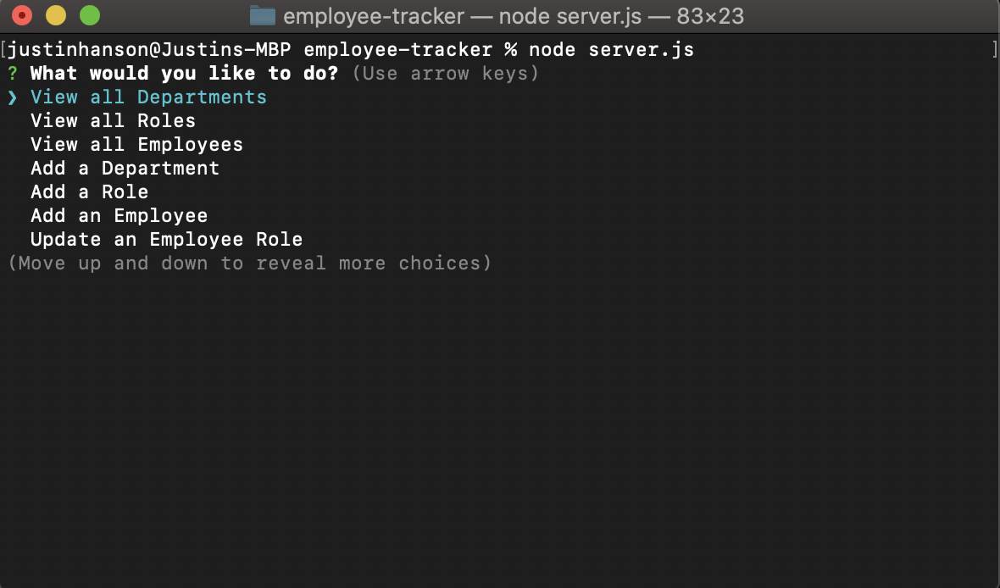
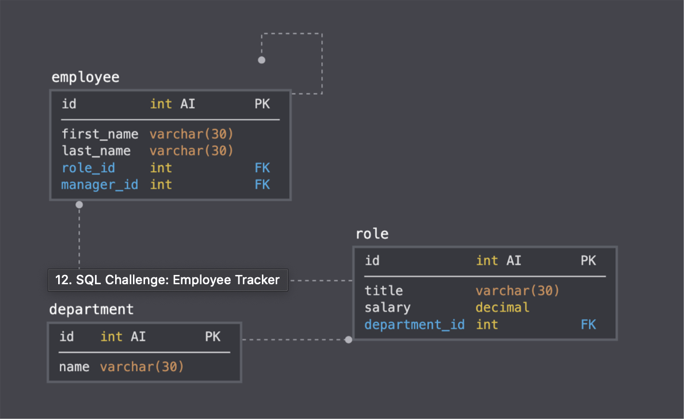

# Employee Database Application
Employee database management interface program that is accessed through the command line.

## Instructions / Walkthrough Video
    https://drive.google.com/file/d/1H6sDC8kmrl5GhAloaqFzu9hKhmJ_58oe/view

This application provides a command line interface to manage and employee database.  Options such as
entering new employees, creating new departments, and creating new positions or roles are available.
To run the program navigate to the root directory of the application and enter the following into the
command line prompt: node server.js

## Main Menu Options in the application:
  
  ### - view all departments -- 
      WHEN I choose to view all departments
      THEN I am presented with a formatted table showing department names and department ids
      (res = query)
  
  ### - view all roles --
      WHEN I choose to view all roles
      THEN I am presented with the job title, role id, the department that role belongs to, and the salary for that role
      (app.get; res = query with join)
  
  ### - view all employees --
      WHEN I choose to view all employees
      THEN I am presented with a formatted table showing employee data, including employee ids,
      first names, last names, job titles, departments, salaries, and managers that the employees report to
      (app.get; res = query with joins)
      
  ### - add a department -- 
      WHEN I choose to add a department
      THEN I am prompted to enter the name of the department and that department is added to the database
      (app.put ; res = options)
  
  ### - add a role --
      WHEN I choose to add a role
      THEN I am prompted to enter the name, salary, and department for the role and that role is added to the database
      (app.put; res = options)
      
  ### - add an employee --
      WHEN I choose to add an employee
      THEN I am prompted to enter the employee’s first name, last name, role, and manager and that employee is added to the database
      (app.put; res = list of questions)

  ### - update an employee role --
    Need to figure out what to do with this one...not exactly clear...I believe
    the program is to present a list of employees...then when an employee is selected then a list of roles is present.  When a new role is selected the database is updated??

## Dependencies:
- You’ll need to use:
- MySQL2 package
- Inquirer package
- console.table package (Links to an external site.) to print MySQL rows to the console.

## Database Structure and Schema (for reference):

### Department
 - id: INT PRIMARY KEY
 - name: VARCHAR(30) to hold department name

### Role
 - id: INT PRIMARY KEY
 - title: VARCHAR(30) to hold role title
 - salary: DECIMAL to hold role salary
 - department_id: INT to hold reference to department role belongs to

### Employee
 - id: INT PRIMARY KEY
 - first_name: VARCHAR(30) to hold employee first name
 - last_name: VARCHAR(30) to hold employee last name
 - role_id: INT to hold reference to employee role
 - manager_id: INT to hold reference to another employee that is manager of the current employee. This field may be null if the employee has no manager.